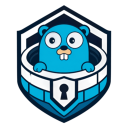
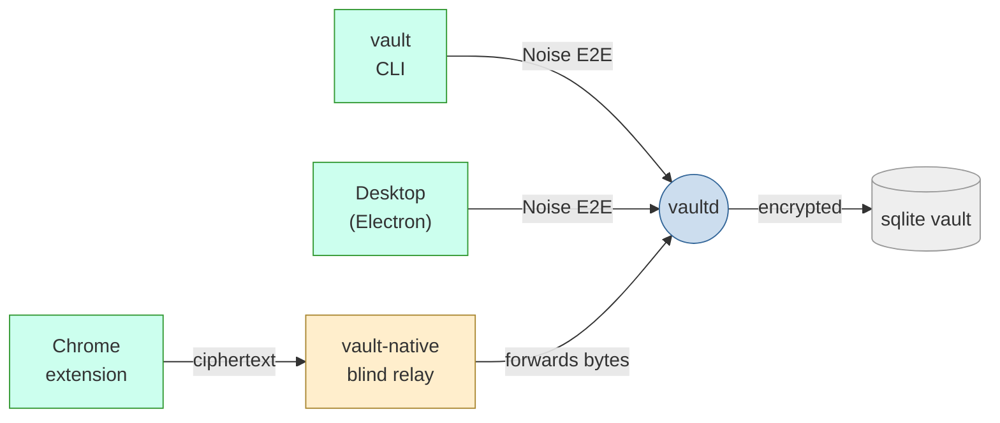
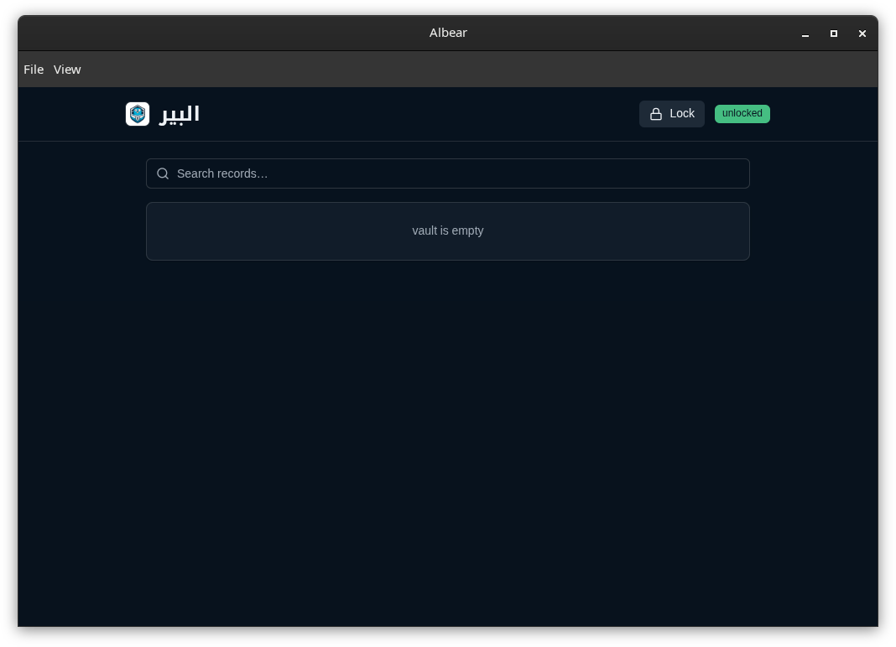
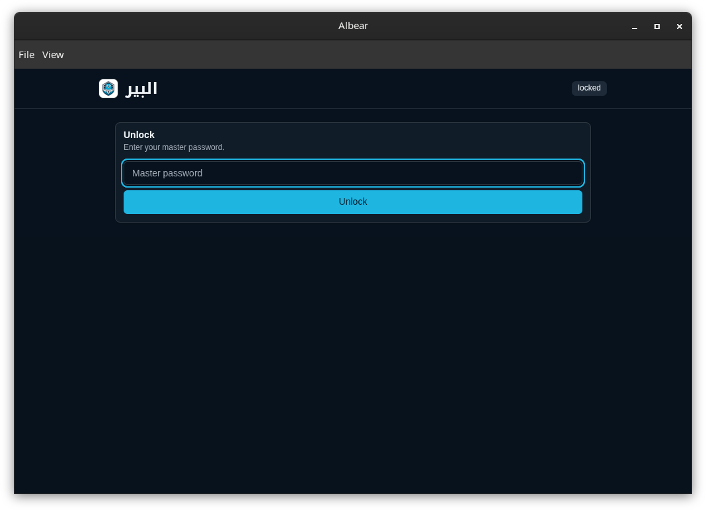
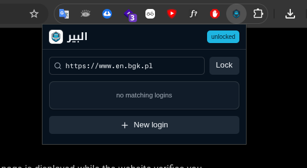
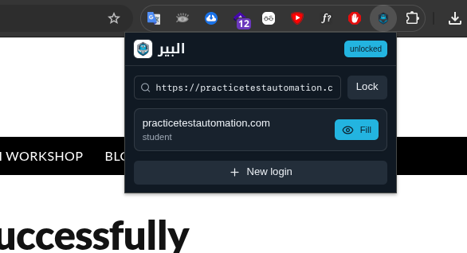

> Your passwords, API keys, notes, and passkeys are safe as long as the Gopher doesn't dig the well, and you'll never find out, because the CIA programmed him to. (joke)

<p align="center">
  
</p>

<h1 align="center">albear — البير</h1>

Local-only encrypted secrets manager. No cloud, no telemetry, no network
listeners — one Go daemon owns the vault; every client talks to it over a
Unix socket on a separately end-to-end encrypted (Noise) channel.



The relay only ever sees ciphertext — it cannot read or forge traffic.

## Screenshots

<p align="center">
  
</p>

<p align="center">
  
</p>

<p align="center">
  
  
</p>

## Install

Linux only, on amd64 and arm64. `vaultd` authorizes clients by checking the
socket peer's credentials, so there is no macOS or Windows build.

```sh
curl -fsSL https://raw.githubusercontent.com/m7medVision/albear/main/install.sh | sh
```

That installs `vaultd`, `vault` and `vault-native` into `~/.local/bin` and adds a
systemd user unit. Set `ALBEAR_INSTALL_DIR` to install elsewhere,
`ALBEAR_VERSION` to pin a tag, or `ALBEAR_NO_SERVICE=1` to skip the unit.

Prefer a package? Grab the `.deb` or `.rpm` from the
[latest release](https://github.com/m7medVision/albear/releases/latest):

```sh
sudo dpkg -i albear_*_linux_amd64.deb    # or: sudo rpm -i albear_*_linux_amd64.rpm
```

Or install the binaries with Go:

```sh
go install github.com/m7medVision/albear/cmd/vaultd@latest
go install github.com/m7medVision/albear/cmd/vault@latest
go install github.com/m7medVision/albear/cmd/vault-native@latest
```

Then start the daemon and create your vault:

```sh
systemctl --user enable --now albear-vaultd   # or just: vaultd &
vault init                                    # no recovery without a backup!
```

Every release also ships `checksums.txt` and signed build provenance, which you
can verify with:

```sh
gh attestation verify albear_v1.2.3_linux_amd64.tar.gz -R m7medVision/albear
```

The desktop app (AppImage) and the extension zip are attached to the same release.

## Build

Building from source is for development — see [Install](#install) to just use it.

```sh
go build ./cmd/...                       # vaultd, vault, vault-native
cd extension && pnpm install && pnpm build
cd desktop && npm install && npm run build
```

## Run

```sh
./vaultd &                              # serves $XDG_RUNTIME_DIR/albear/vault.sock
./vault init                            # create the vault (no recovery without backup!)
./vault unlock
./vault add login --name GitHub --username you --url https://github.com --generate
./vault list
./vault show github --reveal
./vault backup create ~/albear.abk
```

### Lock & unlock

```sh
./vault unlock        # prompts for the master password; key lives in memory only
./vault lock          # forgets the key, drops all sessions — vault stays on disk
./vault status        # shows: uninitialized | locked | unlocked (+ record count)
./vault panic-lock    # forced lock, e.g. if you suspect a client is compromised
```

A restart of `vaultd` also locks the vault — there is no persistent unlock.

### CLI help

```sh
./vault help          # lists every command and the usage synopsis
./vault               # same as help, exits with usage code
```

Commands: `init status unlock lock panic-lock add list search show edit remove
generate password clients backup events doctor install destroy version`.

## Dev mode

`make` targets run each component with live reload. Start the daemon first —
it owns the socket every client connects to.

```sh
make devd             # go run ./cmd/vaultd         (the daemon)
make dev-ext          # cd extension && pnpm dev     (Vite, rebuilds on save)
make dev-desktop      # cd desktop && npm start      (Electron + hot reload)
```

## Install the extension in Chrome (dev)

```sh
make build
make devd &                         # daemon must be running to pair
./vault install chrome --print-only # prints the native-host + extension paths
./vault install chrome              # writes the native-messaging manifest
```

Then in Chrome:

1. Open `chrome://extensions`, enable **Developer mode**.
2. **Load unpacked** → select the `extension/dist` path printed above.
3. Open the popup → **Pair with vaultd**.
4. In a terminal run `./vault clients approve` and confirm the phrase matches
   on both sides.

## Run the desktop app

```sh
cd desktop && npm install
make devd &           # daemon must be running; desktop speaks Noise to it
make dev-desktop      # or: cd desktop && npm start
```

The desktop app connects to `vaultd` over the same socket the CLI uses;
unlock from the app's UI after pairing.

## Tests

```sh
go test ./...
cd extension && pnpm test
cd desktop && npm test
```

## Invariants

- Only `vaultd` opens the database; plaintext never touches disk.
- CQRS with sqlc: `sql/commands.sql` (writes) and `sql/queries.sql` (reads) — single-statement only.
- Domain packages import no SQL, HTTP, Chrome, or CLI machinery.
- Sessions are memory-only, epoch-bound, and die on lock or restart.
- Suspicious activity locks the vault; nothing automatic ever deletes it.
