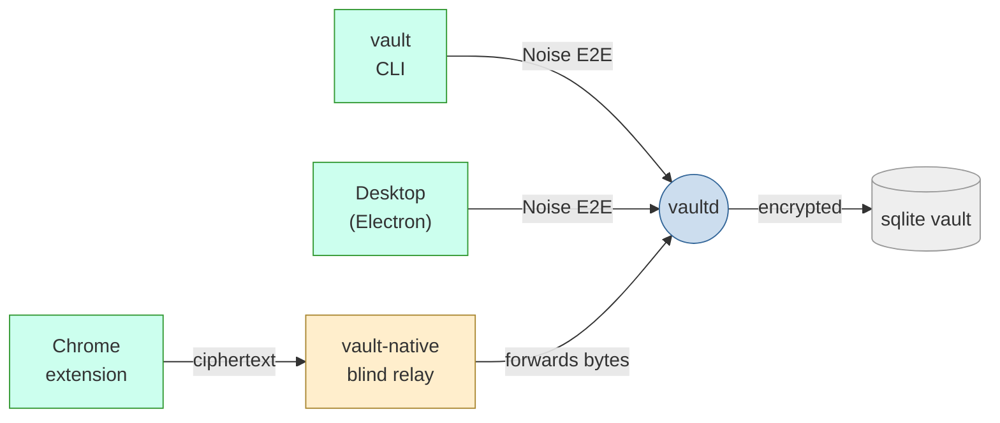

# albear — البير

Local-only encrypted secrets manager. No cloud, no telemetry, no network
listeners — one Go daemon owns the vault; every client talks to it over a
Unix socket on a separately end-to-end encrypted (Noise) channel.



The relay only ever sees ciphertext — it cannot read or forge traffic.

## Build

```sh
go build ./cmd/...                       # vaultd, vault, vault-native
cd extension && pnpm install && pnpm build
cd desktop && npm install && npm run build
```

## Run

```sh
./vaultd &                              # serves $XDG_RUNTIME_DIR/albear/vault.sock
./vault init                            # create the vault (no recovery without backup!)
./vault unlock
./vault add login --name GitHub --username you --url https://github.com --generate
./vault list
./vault show github --reveal
./vault backup create ~/albear.abk
```

## Tests

```sh
go test ./...
cd extension && pnpm test
cd desktop && npm test
```

## Invariants

- Only `vaultd` opens the database; plaintext never touches disk.
- CQRS with sqlc: `sql/commands.sql` (writes) and `sql/queries.sql` (reads) — single-statement only.
- Domain packages import no SQL, HTTP, Chrome, or CLI machinery.
- Sessions are memory-only, epoch-bound, and die on lock or restart.
- Suspicious activity locks the vault; nothing automatic ever deletes it.
