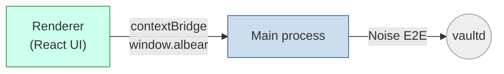

# Albear Desktop

Electron + React desktop client for Albear, the local-only encrypted secrets
manager. UI mirrors the Chrome extension (shared design tokens in
`src/renderer/styles/globals.css`, components in
`src/renderer/components/ui/`), styled with Tailwind v4.



The renderer never touches the socket or Noise state — those live in the main
process behind the `contextBridge` API.

## Develop

```bash
npm install
npm start          # dev server + electron, hot reload
```

## Build & package

```bash
npm run build      # production webpack (main + renderer)
npm run package    # platform installers → release/build/
npm run lint
npm test
```

## Versioning

Version lives in `release/app/package.json`, kept in lockstep with the
repo-wide `vX.Y.Z` tag. Auto-updates use `electron-updater` against GitHub
releases (publish target in root `package.json` under `build.publish`);
skipped in unpackaged dev builds.
